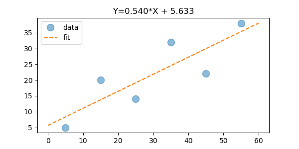

# Linear Regression with Python

This demo shows how to use scipy to calculate the regression line for paired X/Y data.

```python
slope, intercept, r, p, stdErr = scipy.stats.linregress(xs, ys)
```

