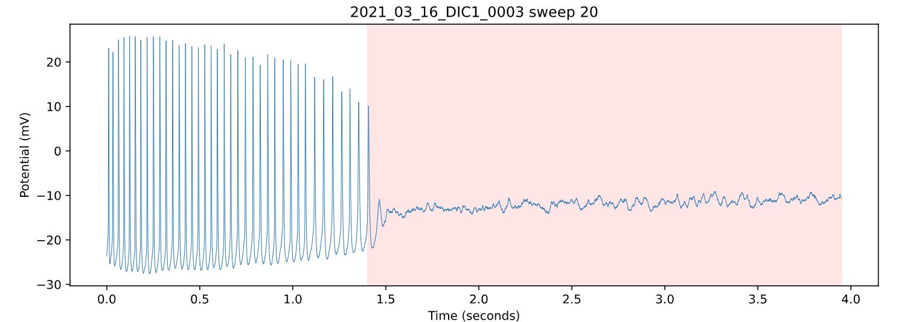
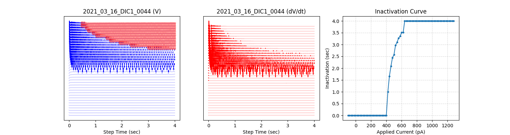

# Spike Inactivation Analysis

Spike inactivation is where a neuron with sustained depolarization abruptly stops firing (a phenomenon distinct from action potential block). Code in this folder identifies and quantifies spike inactivation in ABF recordings.

Interact with [`analyze.py`](analyze.py) from the command line:

```
python analyze.py -h
```



